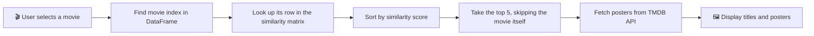

<div align="center">

# 🎬 Movie Recommendation System

## ✨ Features

- 🎯 **Content-based recommendations**: 5 similar movies for any title you pick
- 🖼️ **Live movie posters** fetched from the TMDB API
- ⚡ **Fast**: model files are cached after the first load
- ☁️ **Lightweight repo**: large `.pkl` files are hosted on Hugging Face and downloaded automatically at startup
- 🎨 **Custom UI** with a background image and responsive 5-column layout
- 🛡️ **Graceful fallback**: shows "Poster unavailable" if the API key is missing or a poster can't be fetched


## 🧠 How It Works



<details>
<summary><b>📖 Click to expand: the recommendation logic in detail</b></summary>

<br>

1. **Data preparation** (done in the notebook): movie metadata such as overview, genres, keywords, cast and crew is cleaned and merged into a single text field called `tags`.
2. **Vectorization**: the `tags` text is converted into numeric vectors.
3. **Similarity matrix**: cosine similarity is computed between every pair of movies, giving an `N × N` matrix saved as `similarity.pkl`.
4. **Recommendation**: for a chosen movie, the app reads its row of the matrix, sorts the scores in descending order, and returns the top 5 excluding itself.


## 🛠️ Tech Stack

| Layer | Tools |
|---|---|
| **Frontend / App** | Streamlit |
| **Data handling** | Pandas, Pickle |
| **ML / NLP** | scikit-learn (vectorization and cosine similarity) |
| **Poster data** | TMDB API |
| **Model hosting** | Hugging Face Hub |
| **Deployment** | Streamlit Community Cloud |

---

## 📂 Project Structure

```text
📦 Movie-Recommendation
 ┣ 📜 app.py               # Streamlit app
 ┣ 📓 movies.ipynb         # EDA, feature engineering, similarity matrix
 ┣ 🖼️ Background5.jpg      # App background image
 ┣ 📄 requirements.txt     # Python dependencies
 ┣ 📁 assets/              # Screenshots for this README
 ┗ 📄 README.md
```

> 💡 `movies_dict.pkl` and `similarity.pkl` are **not** stored in this repo. The app downloads them from [Hugging Face](https://huggingface.co/Faizan-Haider/Movie-Recommendation) on first run.

---


## 🔑 TMDB API Key Setup

Posters come from [The Movie Database (TMDB)](https://www.themoviedb.org/). The app works without a key, but posters will show as unavailable.

<details>
<summary><b>Step-by-step: get a free key</b></summary>

<br>

1. Create a free account at [themoviedb.org](https://www.themoviedb.org/signup).
2. Go to **Settings → API** and request an API key.
3. Copy your **API Key (v3 auth)**.

</details>

<details>
<summary><b>Where to put the key</b></summary>

<br>

| Environment | How |
|---|---|
| **Local (env var)** | `export TMDB_API_KEY="your_key"` |
| **Local (secrets file)** | Create `.streamlit/secrets.toml` with `TMDB_API_KEY = "your_key"` |
| **Streamlit Cloud** | App → **Settings → Secrets** → add `TMDB_API_KEY = "your_key"` |

> ⚠️ **Never commit your API key or `secrets.toml` to GitHub.** Add `.streamlit/secrets.toml` to your `.gitignore`.

</details>

---


## 🗺️ Roadmap

- [x] Content-based recommendations
- [x] Poster fetching from TMDB
- [x] Cloud deployment with remote model files
- [ ] Show movie overview, rating and release year
- [ ] Filter recommendations by genre
- [ ] Add trailers and watch links
- [ ] Try embeddings (e.g. sentence transformers) for better similarity

---

## 🙌 Acknowledgements

- [TMDB](https://www.themoviedb.org/) for movie data and posters. *This product uses the TMDB API but is not endorsed or certified by TMDB.*
- [Streamlit](https://streamlit.io/) for making data apps easy to build
- [Hugging Face](https://huggingface.co/) for free model file hosting

---

<div align="center">

### ⭐ If you found this project useful, please give it a star!

Made with ❤️ by **[Faizan Haider](https://github.com/YOUR_GITHUB_USERNAME)**

</div>
