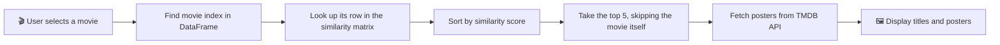

<div align="center">

# 🎬 Movie Recommendation System

**Pick a movie you love, get 5 similar ones with posters in one click.**

[](https://YOUR-APP-NAME.streamlit.app)
[](https://colab.research.google.com/github/YOUR_GITHUB_USERNAME/YOUR_REPO_NAME/blob/main/movies.ipynb)
[](https://huggingface.co/Faizan-Haider/Movie-Recommendation)


### [🚀 Try the Live App](https://YOUR-APP-NAME.streamlit.app) · [📓 View the Notebook](./movies.ipynb) · [🐞 Report a Bug](../../issues)

</div>

---

## 📑 Table of Contents

- [✨ Features](#-features)
- [🖼️ Screenshots](#️-screenshots)
- [🧠 How It Works](#-how-it-works)
- [🛠️ Tech Stack](#️-tech-stack)
- [📂 Project Structure](#-project-structure)
- [⚡ Quick Start](#-quick-start)
- [🔑 TMDB API Key Setup](#-tmdb-api-key-setup)
- [☁️ Deployment Guide](#️-deployment-guide)
- [❓ FAQ](#-faq)
- [🗺️ Roadmap](#️-roadmap)
- [🙌 Acknowledgements](#-acknowledgements)

---

## ✨ Features

- 🎯 **Content-based recommendations**: 5 similar movies for any title you pick
- 🖼️ **Live movie posters** fetched from the TMDB API
- ⚡ **Fast**: model files are cached after the first load
- ☁️ **Lightweight repo**: large `.pkl` files are hosted on Hugging Face and downloaded automatically at startup
- 🎨 **Custom UI** with a background image and responsive 5-column layout
- 🛡️ **Graceful fallback**: shows "Poster unavailable" if the API key is missing or a poster can't be fetched

---

## 🖼️ Screenshots

> 📸 Add your own screenshots to an `assets/` folder and update the paths below.

| Home Page | Recommendations |
|:---:|:---:|
|  |  |

---

## 🧠 How It Works



<details>
<summary><b>📖 Click to expand: the recommendation logic in detail</b></summary>

<br>

1. **Data preparation** (done in the notebook): movie metadata such as overview, genres, keywords, cast and crew is cleaned and merged into a single text field called `tags`.
2. **Vectorization**: the `tags` text is converted into numeric vectors.
3. **Similarity matrix**: cosine similarity is computed between every pair of movies, giving an `N × N` matrix saved as `similarity.pkl`.
4. **Recommendation**: for a chosen movie, the app reads its row of the matrix, sorts the scores in descending order, and returns the top 5 excluding itself.

```python
def recommend(movie):
    movie_index = movies[movies["title"] == movie].index[0]
    distances = similarity[movie_index]
    movies_list = sorted(list(enumerate(distances)),
                         reverse=True, key=lambda x: x[1])[1:6]
    ...
```

</details>

<details>
<summary><b>📊 Click to expand: exploratory data analysis (EDA)</b></summary>

<br>

The full EDA, feature engineering and similarity computation live in [`movies.ipynb`](./movies.ipynb). You can run it in Google Colab using the badge at the top of this page.

</details>

---

## 🛠️ Tech Stack

| Layer | Tools |
|---|---|
| **Frontend / App** | Streamlit |
| **Data handling** | Pandas, Pickle |
| **ML / NLP** | scikit-learn (vectorization and cosine similarity) |
| **Poster data** | TMDB API |
| **Model hosting** | Hugging Face Hub |
| **Deployment** | Streamlit Community Cloud |

---

## 📂 Project Structure

```text
📦 Movie-Recommendation
 ┣ 📜 app.py               # Streamlit app
 ┣ 📓 movies.ipynb         # EDA, feature engineering, similarity matrix
 ┣ 🖼️ Background5.jpg      # App background image
 ┣ 📄 requirements.txt     # Python dependencies
 ┣ 📁 assets/              # Screenshots for this README
 ┗ 📄 README.md
```

> 💡 `movies_dict.pkl` and `similarity.pkl` are **not** stored in this repo. The app downloads them from [Hugging Face](https://huggingface.co/Faizan-Haider/Movie-Recommendation) on first run.

---

## ⚡ Quick Start

<details open>
<summary><b>💻 Run locally</b></summary>

<br>

```bash
# 1. Clone the repository
git clone https://github.com/YOUR_GITHUB_USERNAME/YOUR_REPO_NAME.git
cd YOUR_REPO_NAME

# 2. (Optional) Create a virtual environment
python -m venv venv
source venv/bin/activate        # Windows: venv\Scripts\activate

# 3. Install dependencies
pip install -r requirements.txt

# 4. Set your TMDB API key (see the section below)
export TMDB_API_KEY="your_key_here"     # Windows PowerShell: $env:TMDB_API_KEY="your_key_here"

# 5. Launch the app
streamlit run app.py
```

Then open **http://localhost:8501** in your browser. 🎉

</details>

<details>
<summary><b>📓 Explore the notebook in Colab</b></summary>

<br>

Click the badge below and run all cells to see how the similarity matrix is built.

[](https://colab.research.google.com/github/YOUR_GITHUB_USERNAME/YOUR_REPO_NAME/blob/main/movies.ipynb)

</details>

---

## 🔑 TMDB API Key Setup

Posters come from [The Movie Database (TMDB)](https://www.themoviedb.org/). The app works without a key, but posters will show as unavailable.

<details>
<summary><b>Step-by-step: get a free key</b></summary>

<br>

1. Create a free account at [themoviedb.org](https://www.themoviedb.org/signup).
2. Go to **Settings → API** and request an API key.
3. Copy your **API Key (v3 auth)**.

</details>

<details>
<summary><b>Where to put the key</b></summary>

<br>

| Environment | How |
|---|---|
| **Local (env var)** | `export TMDB_API_KEY="your_key"` |
| **Local (secrets file)** | Create `.streamlit/secrets.toml` with `TMDB_API_KEY = "your_key"` |
| **Streamlit Cloud** | App → **Settings → Secrets** → add `TMDB_API_KEY = "your_key"` |

> ⚠️ **Never commit your API key or `secrets.toml` to GitHub.** Add `.streamlit/secrets.toml` to your `.gitignore`.

</details>

---

## ☁️ Deployment Guide

<details>
<summary><b>Deploy your own copy on Streamlit Community Cloud</b></summary>

<br>

1. Fork this repository.
2. Upload your own `movies_dict.pkl` and `similarity.pkl` to a Hugging Face repo, then update `HF_USERNAME` and `HF_REPO` in `app.py`.
3. Go to [share.streamlit.io](https://share.streamlit.io) and click **New app**.
4. Select your fork, branch `main`, and main file `app.py`.
5. Add `TMDB_API_KEY` under **Advanced settings → Secrets**.
6. Click **Deploy**. 🚀

</details>

---

## ❓ FAQ

<details>
<summary><b>Why are the .pkl files not in the repo?</b></summary>

<br>

The similarity matrix is very large, and GitHub limits regular file sizes to 100 MB. Hosting the files on Hugging Face keeps this repo small, and the app downloads them automatically on first launch.

</details>

<details>
<summary><b>Why does the first load take a while?</b></summary>

<br>

The app downloads the model files the first time it starts. After that they are cached, so later loads are fast.

</details>

<details>
<summary><b>Why do I see "Poster unavailable"?</b></summary>

<br>

Either the TMDB API key is missing or invalid, the movie has no poster on TMDB, or the request timed out. Check your key setup above.

</details>

<details>
<summary><b>Can I add more movies?</b></summary>

<br>

Yes. Update the dataset in the notebook, regenerate `movies_dict.pkl` and `similarity.pkl`, and upload them to your Hugging Face repo.

</details>

---

## 🗺️ Roadmap

- [x] Content-based recommendations
- [x] Poster fetching from TMDB
- [x] Cloud deployment with remote model files
- [ ] Show movie overview, rating and release year
- [ ] Filter recommendations by genre
- [ ] Add trailers and watch links
- [ ] Try embeddings (e.g. sentence transformers) for better similarity

---

## 🙌 Acknowledgements

- [TMDB](https://www.themoviedb.org/) for movie data and posters. *This product uses the TMDB API but is not endorsed or certified by TMDB.*
- [Streamlit](https://streamlit.io/) for making data apps easy to build
- [Hugging Face](https://huggingface.co/) for free model file hosting

---

<div align="center">

### ⭐ If you found this project useful, please give it a star!

Made with ❤️ by **[Faizan Haider](https://github.com/YOUR_GITHUB_USERNAME)**

</div>
